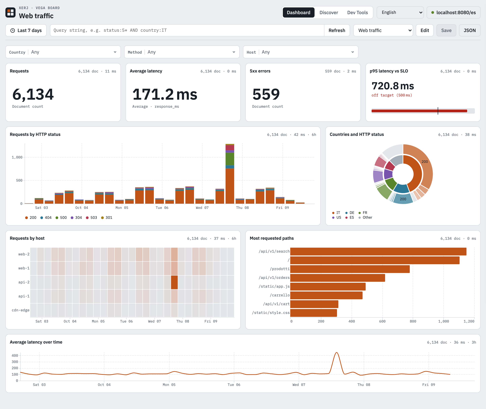

# XERJ Vega Board

*[English](README.md) · Italiano*

Un'interfaccia leggera ed estendibile in stile Kibana (**Dashboard**, **Discover**, **Dev Tools**) per [XERJ](https://github.com/xerj-org/xerj)
e per qualsiasi motore con API compatibile Elasticsearch. Ogni grafico è un widget modulare con la sua query e una spec Vega-Lite.



- **Leggera**: circa 73 KB di codice compresso con gzip, nessuna build, nessuna dipendenza npm. ES modules nativi, serviti così come sono.
- **Estendibile**: un widget, un controllo o una pagina nuovi sono un file più una riga in un manifest. Il core non va mai toccato.

## Funzioni

- **Dashboard**: griglia a 12 colonne, catalogo dei widget, editor laterale, query bar e filtri a chip include/esclude, filtri incrociati
  cliccando un grafico, zoom temporale col trascinamento, aggiornamento automatico, salvataggio nell'indice `vega-dashboards`. Barra dei controlli
  con gli **elenchi opzioni** (uno o più valori, includi/escludi). **Colori stabili**: un valore tiene il suo colore in tutti i pannelli,
  con qualsiasi filtro, e si può cambiare a mano.
- **Discover**: istogramma, campi con valori più frequenti, documenti espandibili (tabella o JSON), filtri include/esclude, «Aggiungi alla dashboard».
- **Dev Tools**: console REST in stile Kibana (Ctrl+Invio), cronologia, esempi, copia come curl.
- **Login**: token API per XERJ (`Authorization: ApiKey …`), utente e password per Elasticsearch/OpenSearch.
  Le credenziali restano solo nella scheda del browser (`sessionStorage`).
- **Widget**: metrica, serie temporale, serie per categoria, classifica, distribuzione, doppio donut, mappa di calore, documenti, ricerca
  con evidenziazione, elenco opzioni, Vega-Lite libero, più un «obiettivo» (metrica contro soglia) come esempio di widget personalizzato.
- **Tema chiaro e scuro**; interfaccia in inglese o italiano, secondo la lingua del browser.

Provata su XERJ v1.0.0-rc.93 e OpenSearch 3.9 (vedi [REPORT.md](REPORT.md)).

## Avvio

La board è una cartella di file statici. Parla col motore dal browser, quindi serve il CORS sul motore oppure un proxy sulla
stessa origine. Il proxy incluso serve la board e inoltra `/es/*` al motore:

```sh
python3 tools/proxy.py --port 8080 --upstream http://localhost:9200
# apri http://localhost:8080 (config.json punta a http://localhost:8080/es)
```

Per un motore in HTTPS con certificato autofirmato (es. la configurazione demo di OpenSearch) aggiungi `--insecure`. Senza un motore,
scegli **Usa i dati demo** nella schermata di accesso: dati sintetici generati nel browser, interrogati con lo stesso JSON.

## Configurazione

Tutto sta in `config.json`. La sezione `connection` governa il login:

| Chiave | Valori | Effetto |
|---|---|---|
| `engine` | `xerj`, `elasticsearch`, `opensearch` | XERJ chiede un token API; gli altri utente e password. |
| `engineSelectable` | `true` / `false` | `true`: nel login compare il flag XERJ; il browser ricorda la posizione. |
| `url` | URL | URL predefinito del motore o del proxy. |
| `urlEditable` | `true` / `false` | `false`: l'URL è fisso e in sola lettura. |
| `showUrl` | `true` / `false` | `false`: il campo URL non compare (e l'URL è fisso). |
| `revealPassword` | `true` / `false` | `false`: niente occhio per vedere password o token. |
| `demo` | `true` / `false` | `false`: niente «Usa i dati demo». |

`pages` elenca le pagine (l'ordine è quello delle schede) e `widgets` i manifest dei widget da caricare.

## Estendere

- **Nuovo widget**: copia `widgets/custom/_template.js` e registralo in `widgets/custom/index.json`.
- **Sostituire un widget standard**: metti in `widgets/custom/` un widget con lo stesso `type`. Le dashboard esistenti continuano a funzionare.
- **Nuova pagina**: `pages/<id>/index.js` più una riga in `config.json`.
- **Verifica**: `node tools/validate.mjs` prova ogni widget sul motore demo e deve finire con `0 errori`.

Contratti e ricette sono in [AGENTS.md](AGENTS.md), scritto sia per le persone sia per gli agent.

## Licenza

[Apache License 2.0](LICENSE). Copyright 2026 Vincenzo Lombardo.

Vega, Vega-Lite e vega-embed (BSD-3-Clause) sono caricati dal CDN e non sono inclusi nel repository.
